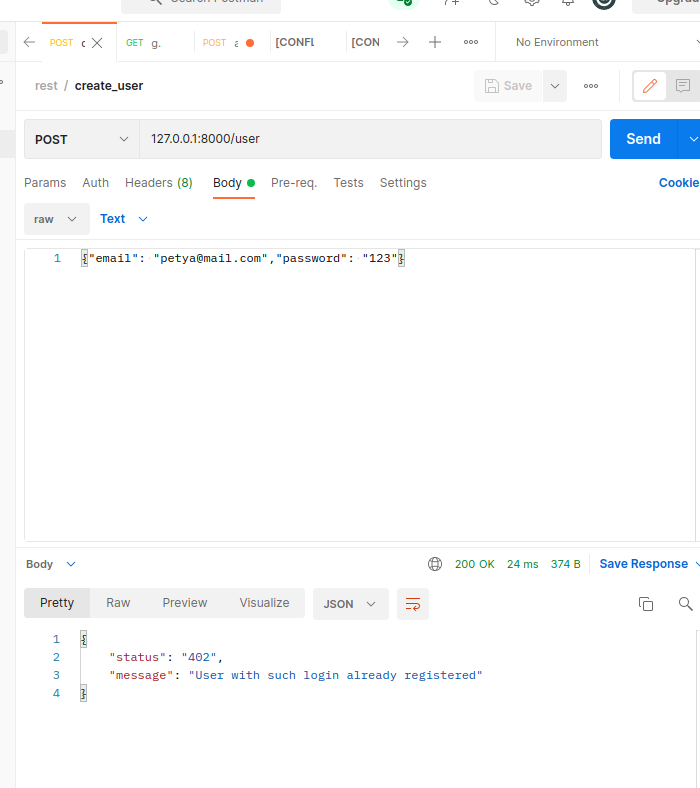
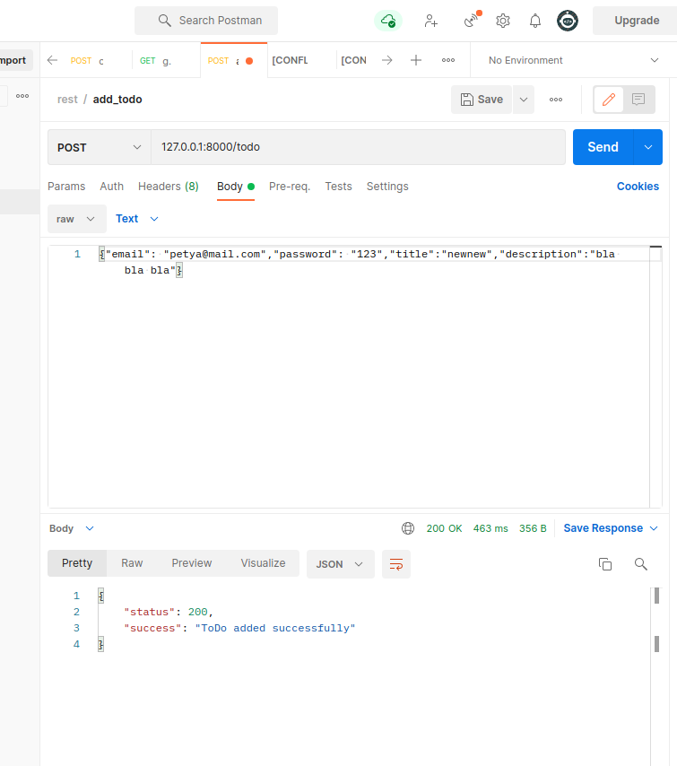
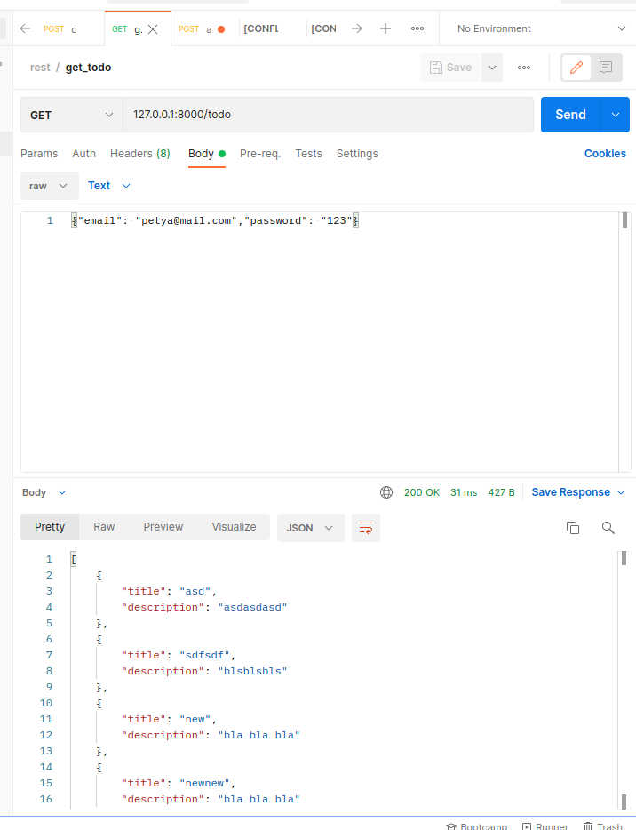
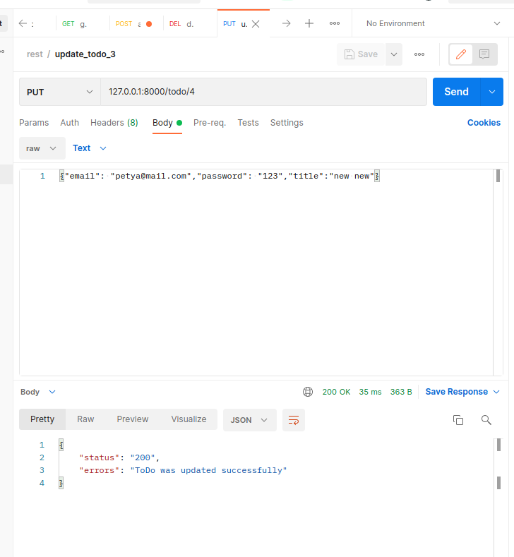
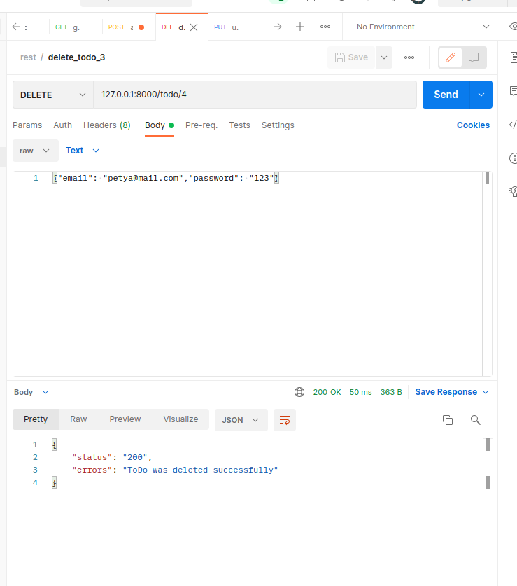

## Запуск
php -S 127.0.0.1:8000 -r public

## Результат
Тестировался в _Postman_.

**Создание пользователя**  
 

 
**Создание тудушки**  
 

  
**Просмотр тудушек пользователя**  
 

**Редактирование тудушки**  
 

**Удаление тудушки**   
 

 
**Добавление файла**  
 
1. Картинки  
 

2.Текстового  
 

__
**Просмотр всех файлов**  
 
1.Пустой список  
 

2.Непустой список  
 

**Просмотр файла по id**  
 
1.Текстового  
 

2.Картинки  
 

**Удаление файла**  
 
1.Существующего  
 

2.Несуществующего  
 

